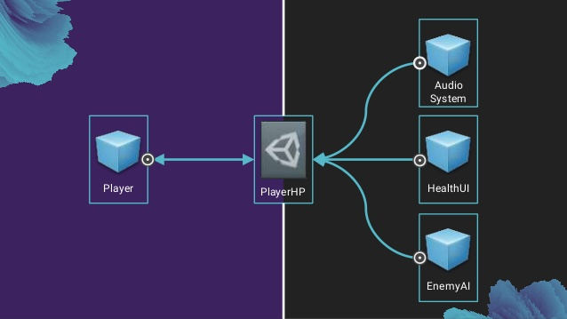
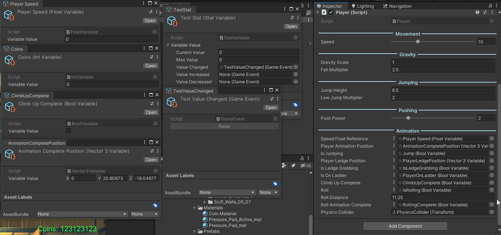

<!-- PROJECT SHIELDS -->
[![Contributors][contributors-shield]][contributors-url]
[![Forks][forks-shield]][forks-url]
[![Stargazers][stars-shield]][stars-url]
[![Issues][issues-shield]][issues-url]
[![MIT License][license-shield]][license-url]

<!-- PROJECT LOGO -->

  

  <h3 align="center">Core Frame Work</h3>

  

    Uses Scriptable Objects as Variables and Game Events. Also Contains Custom Attributes.
     
     
    <a href="https://github.com/JamesLaFritz/CoreFrameWork/issues">Report Bug</a>
    ·
    <a href="https://github.com/JamesLaFritz/CoreFrameWork/issues">Request Feature</a>
  

 

<!-- Links -->

  
   
  
  

<!-- TABLE OF CONTENTS -->

  
<h2 style="display: inline-block">Table of Contents</h2>

  <ol>
    <li>
      <a href="#about-the-project">About The Project</a>
      <ul>
        <li><a href="#scriptable-object-variables-and-game-events">Scriptable Object Variables and Game Events</a></li>
      </ul>
      <ul>
        <li><a href="#custom-attributes">Custom Attributes</a></li>
      </ul>
      <ul>
        <li><a href="#built-with">Built With</a></li>
      </ul>
      <ul>
        <li><a href="#installation">Installation</a></li>
      </ul>
    </li>
    <li><a href="#license">License</a></li>
    <li><a href="#acknowledgements">Acknowledgements</a></li>
  </ol>

<!-- ABOUT THE PROJECT -->
## About The Project

### Scriptable Object Variables and Game Events
-------------------------------------------------------------------------------
[Using ScriptableObject Variables](https://blog.devgenius.io/script-communication-in-unity-using-scriptable-objects-ad2ef0d99c59)
[ScriptableObject Game Events](https://blog.devgenius.io/scriptableobject-game-events-1f3401bbde72)

### Custom Attributes
-------------------------------------------------------------------------------
[Making the Inspector Look Better](https://blog.devgenius.io/making-the-inspector-look-better-175baf39ada0)

### Built With

* 

<!-- Installation -->
### Installation
[Creating and Using Custom Packages](https://blog.devgenius.io/creating-custom-packages-for-use-in-unity-7dfbaa49e4b4)

* In Unity open the package manager
  *  Go to Window->PackageManager
  * 
* Install this Package from git url
  * Click the Plus Drop down
  * Select "add package from git URL" 
     * https://github.com/JamesLaFritz/CoreFrameWork.git
     * Select add
  * 

<!-- ROADMAP -->
## Roadmap

See the [open issues](https://github.com/JamesLaFritz/CoreFrameWork/issues) for a list of proposed features (and known issues).

<!-- LICENSE -->
## License

Distributed under the MIT License. See `LICENSE` for more information.

<!-- ACKNOWLEDGEMENTS -->
## Acknowledgements

* Based on Ryan Hipple's Game Architecture with Scriptable Objects from Unite Austin 2017 
  * [Ryan Hipple's Game Architecture with Scriptable Objects from Unite Austin 2017 ](https://github.com/roboryantron/Unite2017)
  * [@roboryantron](https://twitter.com/roboryantron)
  * [The video for the talk is posted on Unity's YouTube page.](https://www.youtube.com/watch?v=raQ3iHhE_Kk)
  * [Here is a blog post He did about the talk](http://www.roboryantron.com/2017/10/unite-2017-game-architecture-with.html)
  * [The slides are on slideshare.](https://www.slideshare.net/RyanHipple/game-architecture-with-scriptable-objects)

<!-- MARKDOWN LINKS & IMAGES -->
<!-- https://www.markdownguide.org/basic-syntax/#reference-style-links -->
[contributors-shield]: https://img.shields.io/github/contributors/JamesLafritz/CoreFrameWork.svg?style=for-the-badge
[contributors-url]: https://github.com/JamesLafritz/CoreFrameWork/graphs/contributors
[forks-shield]: https://img.shields.io/github/forks/JamesLafritz/CoreFrameWork.svg?style=for-the-badge
[forks-url]: https://github.com/JamesLafritz/CoreFrameWork/network/members
[stars-shield]: https://img.shields.io/github/stars/JamesLafritz/CoreFrameWork.svg?style=for-the-badge
[stars-url]: https://github.com/JamesLafritz/CoreFrameWork/stargazers
[issues-shield]: https://img.shields.io/github/issues/JamesLafritz/CoreFrameWork.svg?style=for-the-badge
[issues-url]: https://github.com/JamesLafritz/CoreFrameWork/issues
[license-shield]: https://img.shields.io/github/license/JamesLafritz/CoreFrameWork.svg?style=for-the-badge
[license-url]: https://github.com/JamesLafritz/CoreFrameWork/blob/main/LICENSE
